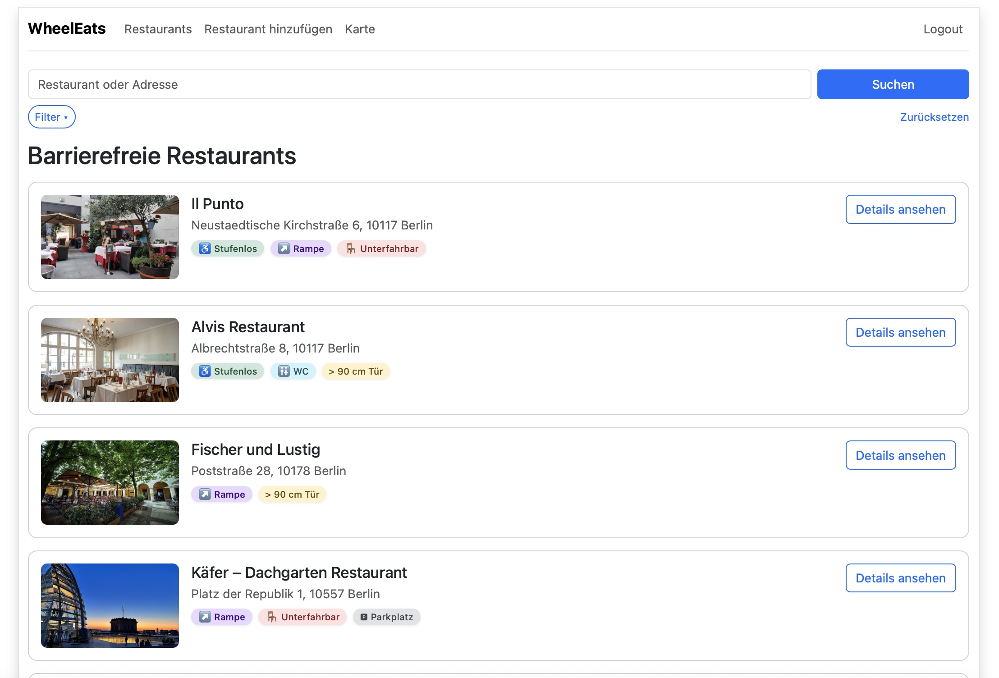
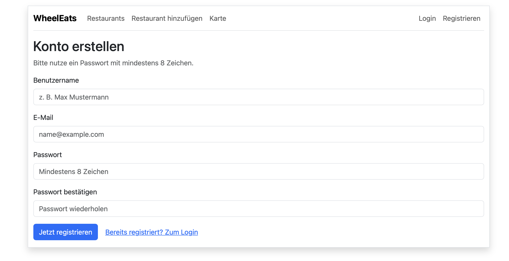
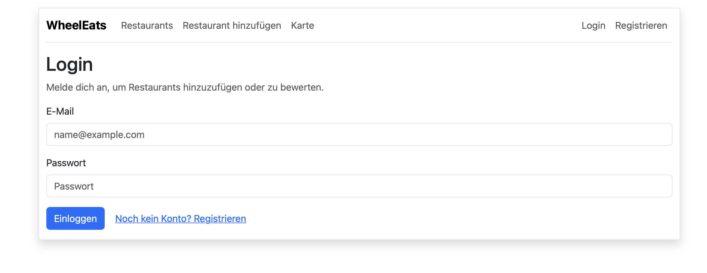
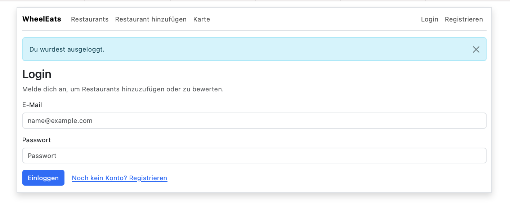
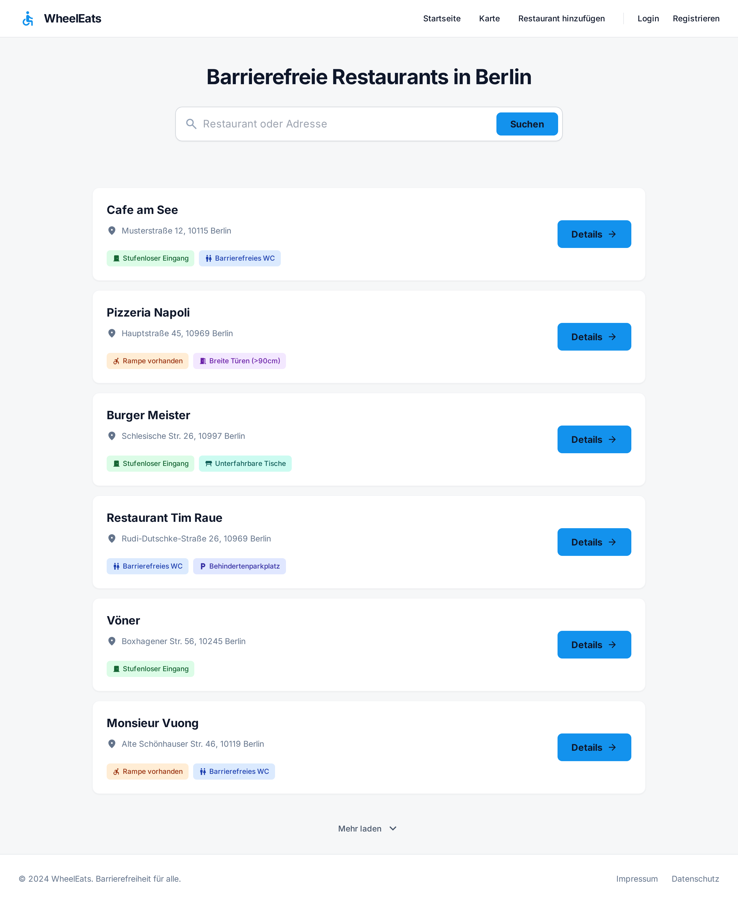
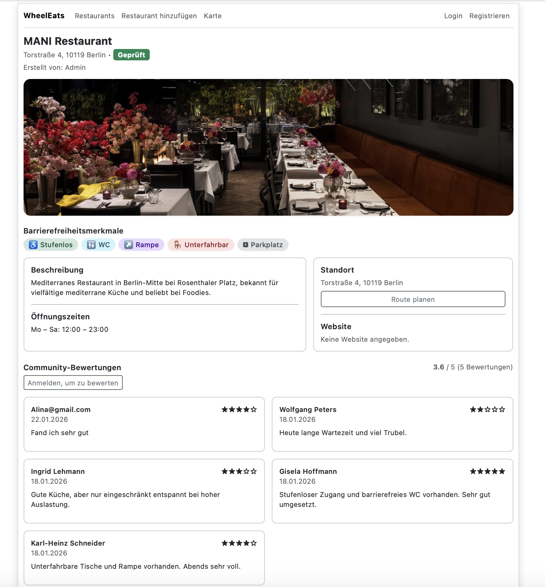
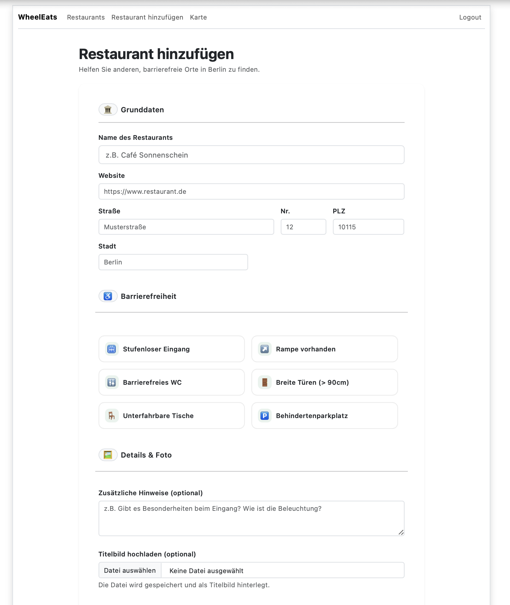
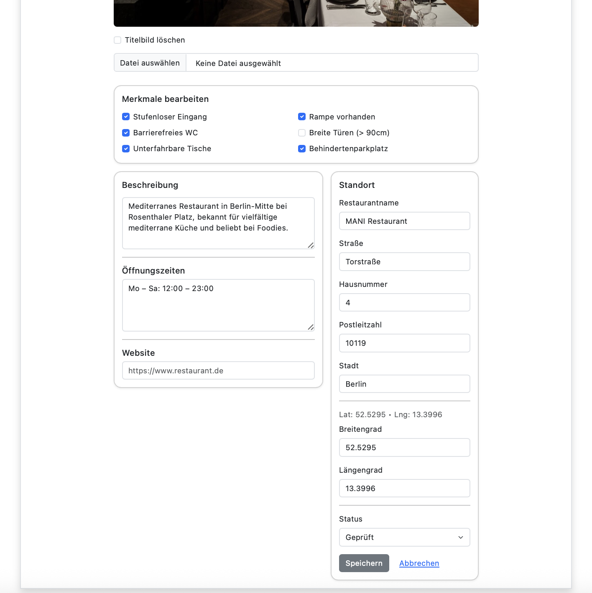
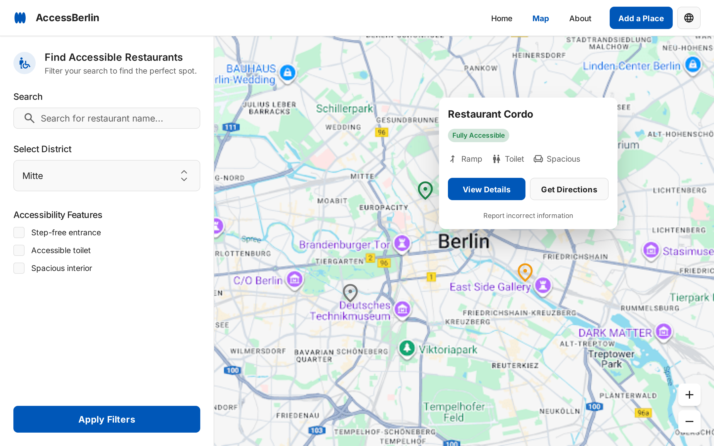
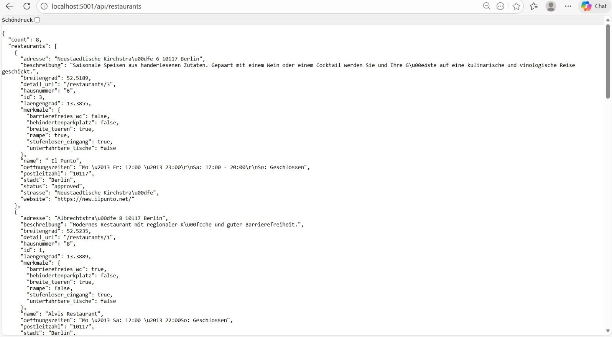

{: .text-delta }

Inhaltsverzeichnis

+ ToC
{: toc }

## Authentifizierung

### `home()`
**Route:** `/`  
**Methods:** `GET`  
**Zugriff:** öffentlich  
**Zweck:** Einstiegspunkt der Anwendung. Leitet auf die Übersicht (`/index`) weiter.  
**Output:** Redirect zu `/index`

**Sample output:**

---

### `register()`
**Route:** `/register`  
**Methods:** `GET`, `POST`  
**Zugriff:** öffentlich  
**Zweck:** Erstellt einen neuen Nutzer, prüft Eingaben (Passwortlänge, Passwortbestätigung, E-Mail eindeutig) und loggt nach erfolgreicher Registrierung direkt ein. Unterstützt optional `next` (nur interne Pfade).  
**Output:** Registrierungsformular / Redirect zur Übersicht

**Sample output:**

---

### `login()`
**Route:** `/login`  
**Methods:** `GET`, `POST`  
**Zugriff:** öffentlich  
**Zweck:** Authentifiziert Nutzer per E-Mail/Passwort (Hash-Prüfung). Setzt Session-Werte (`logged_in`, `user_id`, `username`, `role`). Unterstützt optional `next` (nur interne Pfade).  
**Output:** Login-Formular / Redirect

**Sample output:**

---

### `logout()`
**Route:** `/logout`  
**Methods:** `GET`  
**Zugriff:** eingeloggte Nutzer  
**Zweck:** Löscht die Session und loggt Nutzer aus.  
**Output:** Redirect zur Login-Seite

**Sample output:**

---

## Restaurants (öffentlich)

### `index()`
**Route:** `/index`  
**Methods:** `GET`  
**Zugriff:** öffentlich  
**Zweck:** Zeigt Restaurantliste mit Suche und optionalen Filtern nach Barrierefreiheitsmerkmalen.  
**Output:** Restaurant-Übersicht

**Suche (Query-Parameter):**
- `q=<text>` durchsucht `name`, `strasse`, `postleitzahl`, `stadt`

**Filter (Query-Parameter, aktiv wenn Wert `1`):**
- `stufenloser_eingang=1`
- `rampe=1`
- `barrierefreies_wc=1`
- `breite_tueren=1`
- `unterfahrbare_tische=1`
- `behindertenparkplatz=1`

Wenn mindestens ein Filter aktiv ist, wird auf `BarrierefreieMerkmale` gejoint und nur Restaurants mit aktivierten Merkmalen angezeigt.

**Sample output:**

---

### `detail(id)`
**Route:** `/restaurants/<int:id>`  
**Methods:** `GET`  
**Zugriff:** öffentlich  
**Zweck:** Detailseite eines Restaurants. Lädt Bewertungen (neueste zuerst) und berechnet Durchschnittsbewertung (`avg`).  
**Output:** Detailansicht

**Sample output:**

---

## Restaurants (eingeloggt)

### `restaurant_new()`
**Route:** `/restaurants/new`  
**Methods:** `GET`, `POST`  
**Zugriff:** eingeloggte Nutzer  
**Zweck:** Einreichen eines neuen Restaurants. Setzt Status auf `pending`, speichert Merkmale (1:1) und optional ein Titelbild. Nicht eingeloggte Nutzer werden auf Login umgeleitet (mit `next`).  
**Output:** Formular / Redirect zur Detailseite

**Sample output:**

---

## Bewertungen

### `restaurant_review_create(id)`
**Route:** `/restaurants/<int:id>/reviews`  
**Methods:** `POST`  
**Zugriff:** eingeloggte Nutzer  
**Zweck:** Erstellt eine Bewertung (1–5 Sterne, optional Text) für ein Restaurant. Validiert Sternebereich und speichert in der DB.  
Nicht eingeloggte Nutzer werden auf Login umgeleitet (ohne `next`).  
**Output:** Redirect zur Detailseite + Flash-Nachricht

---

## Admin-Funktionen

### `restaurant_edit(id)`
**Route:** `/restaurants/<int:id>/edit`  
**Methods:** `GET`, `POST`  
**Zugriff:** **Admin**  
**Zweck:** Admin kann Restaurantdaten bearbeiten (Name/Adresse/Koordinaten/Beschreibung/Öffnungszeiten/Website), Merkmale aktualisieren und Status setzen (`pending`/`approved`).  
Zusätzlich: Titelbild löschen oder ersetzen (inkl. Löschen alter Datei).  
**Output:** Edit-Formular / Redirect zur Detailseite

**Sample output:**

---

### `restaurant_delete(id)`
**Route:** `/restaurants/<int:id>/delete`  
**Methods:** `POST`  
**Zugriff:** **Admin**  
**Zweck:** Löscht ein Restaurant. Abhängige Datensätze werden über definierte ORM-Relations/Cascades entfernt (sofern im Datenmodell konfiguriert).  
**Output:** Redirect zur Übersicht

**Sample output:**

---

### `review_delete(id)`
**Route:** `/reviews/<int:id>/delete`  
**Methods:** `POST`  
**Zugriff:** **Admin**  
**Zweck:** Löscht eine Bewertung anhand ihrer ID.  
**Output:** Redirect zur Restaurant-Detailseite

**Sample output:**

---

## Karte

### `restaurant_map()`
**Route:** `/map`  
**Methods:** `GET`  
**Zugriff:** öffentlich  
**Zweck:** Zeigt eine **statische** Kartenansicht (ohne JavaScript). Restaurants mit Koordinaten werden aus der DB geladen und als Marker in eine OpenStreetMap-StaticMap-URL eingebaut.  
**Output:** Kartenansicht als Bild + Liste der Restaurants

**Sample output:**

---

## JSON API

### `api_restaurants()`
**Route:** `/api/restaurants`  
**Methods:** `GET`  
**Zugriff:** öffentlich  
**Zweck:** Liefert alle Restaurants als JSON (inkl. Adresse, Status, Koordinaten und Barrierefreiheitsmerkmalen).  
**Output:** JSON `{ count, restaurants[] }`

**Sample output:**

---

## Upload-Regeln (Titelbild)

- Upload-Verzeichnis: `static/uploads`
- Max. Dateigröße: 6 MB (`MAX_CONTENT_LENGTH`)
- Erlaubte Dateiendungen: `png`, `jpg`, `jpeg`, `webp`
- Dateinamen werden mit `secure_filename` abgesichert
- Bei Dateinamenskollision wird ein Timestamp vorangestellt (z.B. `1700000000_name.png`)
- Beim Ersetzen/Löschen des Titelbildes wird die alte Datei entfernt (Admin-Edit)

---

## Rollen & Zugriffsschutz

- Login-Prüfung über `session["logged_in"]`
- Admin-Prüfung über `session["role"] == "admin"`
- Admin-only: Restaurant bearbeiten/löschen, Bewertung löschen
- Eingeloggt: Restaurant einreichen, Bewertung erstellen