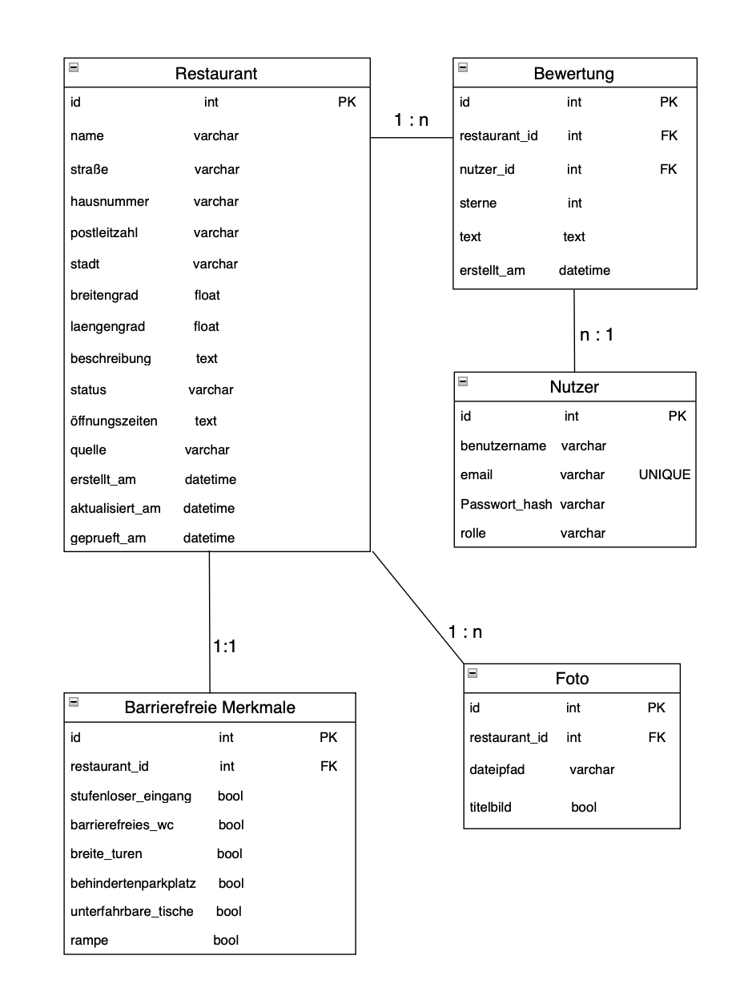

{: .label }
[Batool, Esma]

{: .no_toc }
## Data model

{: .text-delta }

Table of contents

+ ToC
{: toc }

[Visualize and describe the data model(s) of your application. This description should match the actual implementation.]