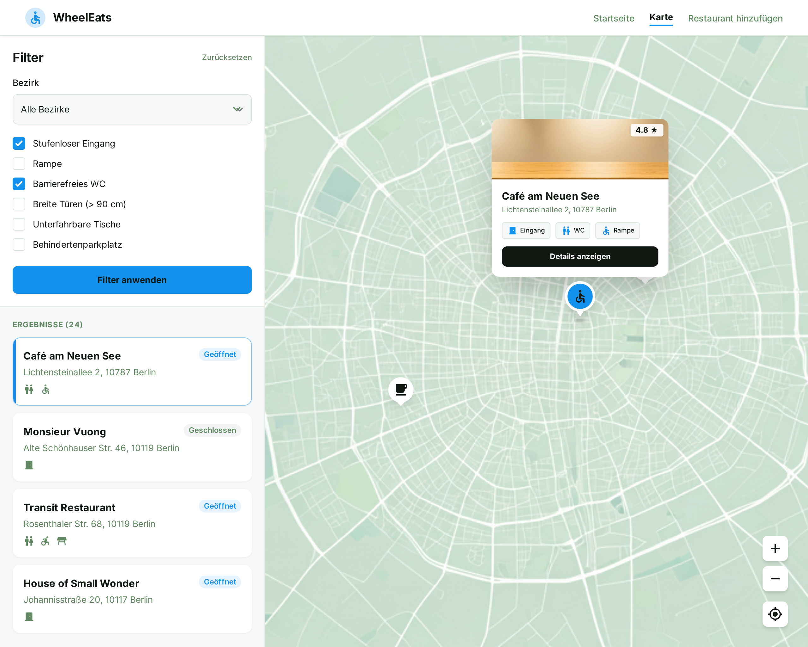

{: .label }
[Batool, Esma]

## Ziel der UI-Entwürfe

Ziel der UI-Entwürfe war es, eine möglichst **übersichtliche, einfache und barrierearme Benutzeroberfläche** zu gestalten.  
Der Fokus lag auf klaren Informationen, gut lesbaren Texten und einer intuitiven Navigation ohne unnötige visuelle Komplexität.

Die folgenden Screenshots zeigen die **final umgesetzte Benutzeroberfläche**, die sich eng an den ursprünglichen Entwürfen orientiert.

---

## Startseite / Übersicht

Die Startseite bietet eine Übersicht aller Restaurants und ermöglicht die Suche sowie das Filtern nach Barrierefreiheitsmerkmalen.

---

## Login

Der Login-Bereich ist bewusst minimal gehalten, um den Einstieg schnell und verständlich zu gestalten.

---

## Restaurant-Detailseite

Die Detailseite zeigt alle relevanten Informationen zu einem Restaurant:
- Adresse
- Beschreibung
- Barrierefreiheitsmerkmale
- Fotos
- Bewertungen

---

## Karte

Die Kartenansicht dient der räumlichen Orientierung.  
Sie zeigt alle Restaurants mit Koordinaten als Marker auf einer **statischen OpenStreetMap-Karte** (ohne JavaScript).

---

## Restaurant hinzufügen

Eingeloggte Nutzer:innen können über dieses Formular neue Restaurants einreichen.  
Der Fokus liegt auf klar beschrifteten Feldern und gut verständlichen Eingaben.

---

## Bezug zur Umsetzung

Die dargestellten UI-Designs wurden während der Implementierung weitgehend beibehalten.  
Einzelne Anpassungen (z. B. Feldanordnung oder Beschriftungen) wurden vorgenommen, um die Bedienbarkeit weiter zu verbessern und Rückmeldungen aus der Nutzerevaluation zu berücksichtigen.